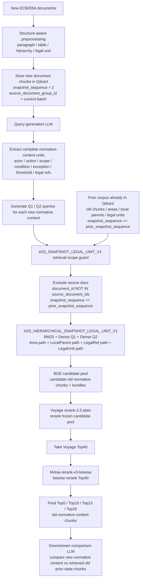

# Team Usage Guide: A2S_SNAPSHOT_LEGAL_UNIT_V1_VOYAGE_TOP40_MXBAI_LISTWISE_SHARE_20260611

## Purpose

This is an informal updates on the progress to respond Marleen's feedbacks.

## Key pipeline results:
For Lane 1 (Same-Family Prior-State Retrieval) with grade 3 as relevance, the below approach achieves the optimal results:
mutiple retrieval path -> union candidate pool -> voyage-reranker-2.5 -> top 40 chunks (recall@40= 0.988) -> mxbai-rerank-v3-listwise reranking -> top 10

This achieves the resuts: (only grade 3 is considered relevant; all grade levels: 0,1,2,3)
P@10 = 0.25
Macro R@10 = 0.901 (averages recall per query first, then averages across queries)
Micro R@10 = 0.676 (pools all relevant items across all queries, then calculates recall once)
binary nDCG = 0.943
graded nDCG = 0.940
MRR = 1
MAP = 0.888 

## Evaluation Lanes In This Package

This package evaluates two retrieval lanes: Lane 1 and Lane 3. Lane 2 is an
important future lane but is not measured in this artifact.

### Lane 1: Same-Family Prior-State Retrieval

Lane 1 tests whether a newly released ECB/EBA normative content item can retrieve
the correct prior-state evidence from the same document family.

The query type is grounded in the original normative content from the new source
document:

```text
newly released normative content
-> Q1 literal / source-grounded query
-> Q2 HyDE-style prior-comparable wording
-> retrieve prior applicable chunks from the same family
-> rerank and evaluate whether the correct prior normative evidence is high
```

Purpose:

- determine whether a new rule changes, amends, replaces, narrows, expands, or
  deletes an earlier rule in the same document family;
- test whether structural and hierarchical retrieval can find the correct old
  prior-state chunks;
- avoid treating consultation or drafting-history material as the primary prior
  comparator.

#### Lane 1 Lifecycle Rule For Consultation / Draft / Final Stages

A production Qdrant VectorDB will contain consultation papers and drafts as well
as final guidelines, RTS, decisions, and supervisory documents. Lane 1 therefore
must be lifecycle-aware, not just similarity-aware.

Expected timeline:

```text
Stage 1:
  current final guideline / RTS is applicable or in force

Stage 2:
  one or more consultation papers or draft versions are published

Stage 3:
  the next final guideline / final draft RTS is adopted or becomes applicable
```

During Stage 2, consultation papers and draft versions should be treated as new
source documents. The monitoring purpose is early warning: banks can identify
the EBA / ECB modification direction and prepare comments, Q&A positions,
internal impact analysis, or lobbying responses. In this stage, the system
should retrieve and rank highly the chunks from the current applicable / in-force
guideline or RTS, not older superseded final versions.

During Stage 3, once the new final guideline or final draft RTS is adopted, the
new final version should be compared primarily against the immediately preceding
applicable / in-force final version it replaces. It should not use the
intermediate consultation paper or draft as the primary comparator, even if the
consultation text is lexically very similar to the final text.

Reason:

```text
Consultation papers and drafts are drafting-history evidence.
They may be useful secondary context, but they are not the operative prior state.
```

This is why Lane 1 needs snapshot and lifecycle governance in addition to dense
similarity, BM25, and reranking. Similar wording alone can incorrectly push a
consultation paper above the true prior in-force rule.

#### Why Source-Document Isolation Is Required

In the intended automatic system, newly released documents are first
preprocessed and stored in Qdrant. A query-generation LLM then reads the new
document chunks and generates queries at the complete normative-content unit
level.

Those generated queries must not retrieve chunks from the same newly ingested
source documents. Otherwise the system can self-retrieve the new text itself,
inflate retrieval scores, and falsely appear to have found prior-state evidence.

Therefore the retrieval corpus must be isolated from the query source documents.
The source documents may exist in Qdrant for preprocessing, query generation,
audit, and downstream comparison, but they must be excluded from prior-state
retrieval for Lane 1 / Lane 3.



#### What This Package Does And Does Not Infer

This package does not infer from PDF content or filenames which documents are
newly ingested source documents and which documents are old comparable prior
documents. That decision is supplied by production-style snapshot metadata and
runtime source-document exclusion.

The implemented retrieval guard is:

```text
candidate.document_id NOT IN source_document_ids
AND candidate.snapshot_sequence <= prior_snapshot_sequence
```

In the verified package run, the six source documents have `snapshot_sequence =
2`, the six prior documents have `snapshot_sequence = 1`, and the no-API
snapshot check showed `source_doc_leakage = []`.

Do not overclaim this as automatic lifecycle intelligence. The package prevents
self-retrieval and future-snapshot leakage, but it does not yet automatically
choose the immediately preceding applicable / in-force version when multiple
prior final versions are present in the same snapshot. That requires additional
lifecycle/version-priority logic.

### Lane 3: Novelty / Gap Detection Branch

Lane 3 is a special branch of Lane 1. It tests cases where the new normative
content is likely newly introduced within the indexed corpus.

Because Lane 3 queries are about genuinely new normative content, similarity
retrieval is expected to struggle: there may be no old chunk with highly similar
wording or a directly comparable old rule. That is not necessarily a retrieval
failure. It may be the correct signal that the new regulation introduced a new
normative content area.

Future downstream comparison can use this insight:

```text
If the best direct-prior candidates remain below a calibrated similarity /
reranker-confidence threshold, the Comparison LLM can treat the proposition as
likely_new_normative_content_within_indexed_corpus instead of forcing a weak old
chunk as the prior comparator.
```

This should be framed as a probabilistic retrieval conclusion, not an absolute
legal statement. The system can say: "within the currently indexed corpus, no
direct prior-state counterpart was found."

## Corpus Used In This Package

The current package uses a snapshot-based setup. Source documents are the newly
released documents used to generate queries. Prior candidates are the searchable
old corpus under the prior snapshot.

| Role | Document family | Document used in this package | Status / timing used in metadata | Main evaluation purpose |
| --- | --- | --- | --- | --- |
| Source | RTS on credit risk adjustments | Final report on draft RTS amending RTS on the calculation of specific credit risk adjustments, 2021 | in force; application date 31/07/2022 | Lane 1 source for changes to the prior CRA RTS family |
| Prior candidate | RTS on credit risk adjustments | Final draft RTS on the calculation of credit risk adjustments, 2013 | in force; application date 19/03/2014 | Prior-state comparator for CRA/SC RA rules |
| Source | Guidelines on internal governance under CRD | Consultation paper on draft revised Guidelines on internal governance under CRD, 2025 | closed consultation | Lane 1 / Lane 3 source for proposed governance updates and new duties |
| Prior candidate | Guidelines on internal governance under CRD | Final report on Guidelines on internal governance under CRD, 2021 | in force; application date 05/12/2021; compliance deadline 31/12/2021 | Prior-state comparator for internal governance |
| Source | Payment fraud reporting under PSD2 decisions | EBA DC 482 amending EBA DC 453, 2023 | adopted decision; publication date 23/03/2023 | Lane 1 source for amendment to an earlier decision |
| Prior candidate | Payment fraud reporting under PSD2 decisions | EBA DC 453 rev1 on reporting of payment fraud data under PSD2, 2022 | adopted decision; publication date 24/06/2022 | Prior-state comparator for payment fraud reporting |
| Source | Definition of default guidelines | Amending Guidelines on the application of the definition of default, 2026 | not yet applicable | Lane 1 source for amendments to default-definition guidance |
| Prior candidate | Definition of default guidelines | Final report Guidelines on the application of the definition of default under Article 178 CRR, 2016 | in force; application date 01/01/2021 | Prior-state comparator for default-definition provisions |
| Source | ECB supervisory priorities | ECB supervisory priorities 2026-28 | current supervisory cycle; not hard law | Lane 3 source for new or shifted supervisory-priority content |
| Prior candidate | ECB supervisory priorities | ECB supervisory priorities 2025-27 | previous supervisory cycle; not hard law | Prior context for supervisory-priority comparison |
| Source | Connected clients guidelines | Decision concerning the partial deletion of the EBA Guidelines on connected clients, 2026 | adopted decision; publication date 26/03/2026 | Lane 1 source for deletion / partial repeal behaviour |
| Prior candidate | Connected clients guidelines | Final report Guidelines on connected clients under Article 4(1)(39) CRR, 2017 | in force; application date 01/01/2019 | Prior-state comparator for connected-clients guidance |

The team should discuss what additional documents can be used to test Lane 3.
This is hard because useful Lane 3 cases require genuinely new normative content
where the old corpus does not contain a direct prior counterpart. Finding such
documents is time-consuming and cannot be solved by adding random adjacent
regulatory documents.

## Current Limitations And Open Design Work

### Legal Status / Applicability Is Not Fully Learned Yet

This package does not yet prove that the system can independently decide which
version is legally in force for every normative content item. The metadata
supports snapshot filtering, but the system still needs stronger lifecycle
governance.

The reason is regulatory reality: an EBA Decision can amend, delete, or override
only a small part of a guideline. The whole guideline document may not be
immediately republished. Therefore lifecycle updates should happen at the
normative-content chunk level, not only at document level.

Example:

```text
Decision on EBA Guidelines on connected clients, 2026
-> partially deletes / changes content in
   Final Guidelines on connected clients (EBA-GL-2017-15)
```

This is a long-time-span, cross-document-type case. A hard-law decision can
override part of a guideline, while the guideline PDF may remain unchanged for a
period. A production VectorDB therefore needs chunk-level update governance:

```text
affected old chunk id
-> status / applicability / valid_end update
-> linked update event
-> source decision id
-> human-verification status
```

Time, document type, and broad metadata filters are not enough by themselves.
Versions may be separated by many years, and the relevant change can be local to
one small normative content block.

### Lane 2 Is Not Tested In This Package

Lane 2 asks a different question:

```text
How can changed normative content in a newly published regulation affect
normative content in other document families?
```

This package does not yet evaluate Lane 2.

Important example for future Lane 2 evaluation:

```text
Final draft RTS amending RTS on the calculation of specific credit risk
adjustments, 2021
-> may affect interpretation or execution of:
   - Final Report Guidelines on the application of the definition of default,
     2016
   - Final Guidelines on management of non-performing and forborne exposures,
     2018
```

The difficulty is query design. Cross-document-family impact is often not
worded similarly. A changed SCRA treatment, discount treatment, default trigger,
capital treatment, or NPL mechanism may affect another document family even when
the old text does not share high lexical or dense-vector similarity with the new
text.

Lane 2 likely needs mechanism/dependency-oriented query families rather than
only Q1/Q2:

```text
changed legal mechanism
-> affected concepts / legal references / calculation inputs / triggers
-> dependency search across prior applicable corpus
-> rerank by whether old normative content depends on the changed mechanism
```

This is future work and should not be inferred from the Lane 1 / Lane 3 results
in this package.

## Query Generation LLM is not developped yet, using Codex GPT5.5 for simulation
Current quries in the Qrels set are design by Codex GPT5.5 mutiple agents (extra reasoning). 

To simulate the pipeline, I asked three agents to understand the full 12 training documets to identify the complete normative contents in the new documents that updates the existing content in the older version (Lane 1) as well the complete normative contents in the new documents that are new to the the older version (Lane 3). Then, I asked two agents to select the most suitable normative contents (up to 10) for Lane 1 and Lane 3 based on their thorough understanding, and generate Query 1 (literal original normative content) and Query2 (HyDE, hypothetical normative content in the old version). Two another agents are requested to conduct verification and audting for the normative content selection and query generations. During normative content selection, I specified that they should endeavor to cover 5 normative types: obligation, prohibition, recommendation, permission, supervisory expectaion but prioritze the query quality in terms of the normative contents' suitability for evaluation qrel design. 

Ultimately, I verified two separete qrels sets for Lane 1 and Lane 3 respectively. **Lane 1 have 10 queries while Lane 3 have 5 queries at present** given the filtering on the query quality and the limited available corpus for Lane 3. (It requires to understand which regulatory docuemnts can affect other document-family). 

### Qrel annotations
TREC's pooling annotation approach is adopted. (https://trec.nist.gov/data/reljudge_eng.html)

As many versions of pipeline design were developed, and they brough about different pools of candidates before going to reranking. Annotation is only made on the union of those candidate pools. For the 12 documents, there are 1900ish chunks in the union candidate pool and there are 15 queries, and therefore Codex GPT5.5 mutiple agents (extra reasoning) are requested to conduct the annotation with the below prompt:


" You Codex are a critical, rigorous, creative, harsh ,senior AI and Data engineer in the regulatory compliance in EU banking domain. You must be allowed to use multiple agents simultaneously. 

Use ：
3 agents to do annotation, and two should be critical, rigorous, creative, harsh ,senior European Regulation Compliance Experts and one should be critical, rigorous, creative, harsh ,senior senior AI and Data engineer to facilitate clear grading. (Just as in a real European bank, where data teams and compliance teams need to collaborate on annotation)

2 agents to verify and audit the annotations.

All judgement should be made based on strongly valid and professional expertises, knowledges, and the evidence in the corpus.  Hallucination and faking evidence are strictly prohibited. You have better provide log of evaluation process and decision-making evidence to facilitate auditing." 


At present, I have only sampled 10 chunks with relevance grade>= 2 out of the top 20 ranked chunks for each query to manually inspect the annotation grading quality. The quality is stable, and makes sense in them. I plan to sample more for manual evaluation.

The Gold set qrel have too few query to prove the retrieval's ability, and I will search for more regulatory files to include them.
